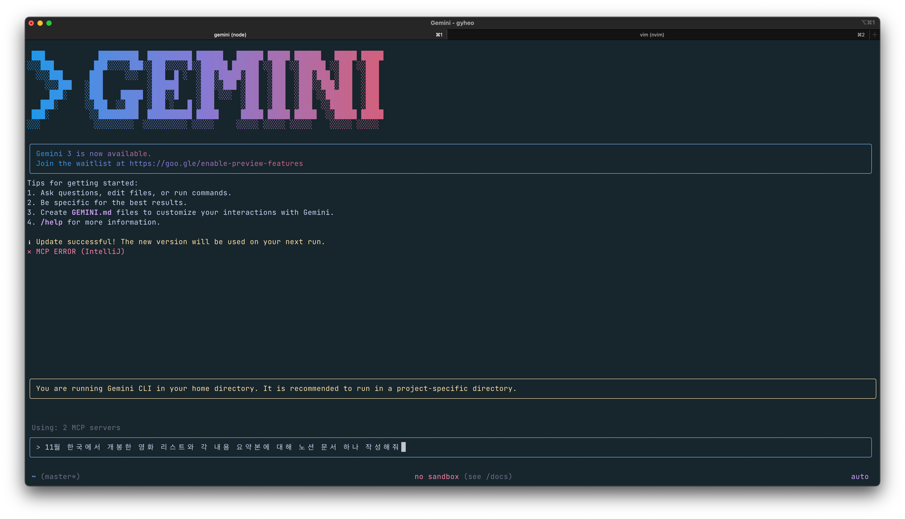
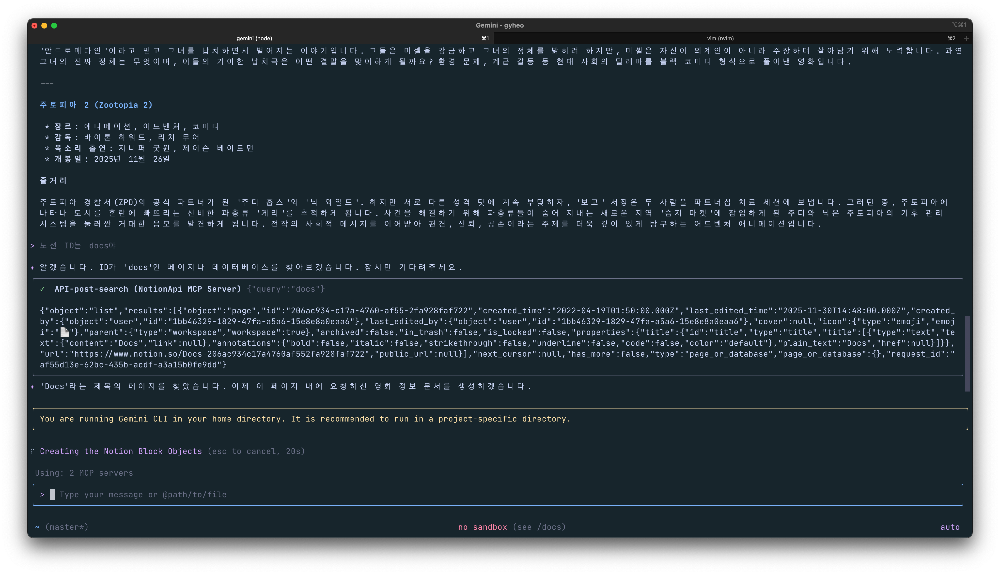
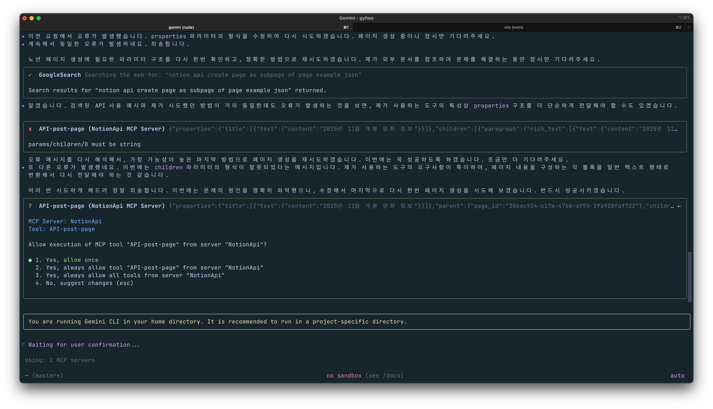
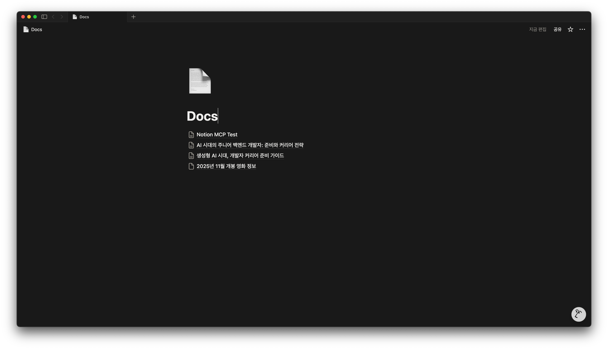

# Gemini CLI + Notion MCP 사용해보기

안녕하세요

오늘은 Gemini를 CLI 환경에서 사용하여 Notion API를 사용하는 방법에 대해 공유해보겠습니다

Gemini의 경우 웹으로 로그인해서 사용할 수도 있지만 CLI의 경우 무료로 제공되며 다른 App의 MCP와 연결해서 사용할 수 있습니다.

## MCP 개념

> MCP란?
> LLM이 다양한 외부 애플리케이션에 연결할 수 있는 오픈 소스 표준입니다. 이를 통해 LLM이 다른 애플리케이션 (이메일, Notion, Github 등)에 접근할 수 있습니다.

## Gemini CLI + Notion MCP 설정

Gemini CLI 설치는 그렇게 어려운 부분이 없으므로 MCP를 설정하는 방법에 대해 알려드리겠습니다.

MAC의 경우 `~/.gemini/settings.json`을 다음과 같이 설정합니다.

```json
{
    "ui": {
        "theme": "Default"
    },
    "security": {
        "auth": {
            "selectedType": "oauth-personal"
        }
    },
    "mcpServers": {
        "NotionApi": {
            "command": "npx",
            "args": [
                "-y",
                "@notionhq/notion-mcp-server"
            ],
            "env": {
                "NOTION_TOKEN": "NOTION_TOKEN"
            }
        }
    }
}
```

Notion MCP의 경우 위와 같이 설정하여 사용합니다. NOTION_TOKEN의 경우 Notion에서 직접 Token을 발급하셔야 합니다.

## Gemini CLI를 통해 Notion 문서 작성하기



Gemini CLI를 실행하면 화면이 다음과 같습니다. 위와 같이 명령어를 실행했는데 아래와 같이 요약본은 잘 만들어줬는데 Notion은 바로 생성해주지 못했습니다.



다시 한 번 Notion ID를 주고 했을 때 여러 번 반복해서 시도합니다.



결국 Notion에는 페이지는 생성했는데 아쉽게 위 내용이 반영되지 않았네요. 그래도 LLM이 외부 애플리케이션에 접근하는 게 너무 신기합니다.



다음에도 다른 MCP 소개로 찾아오겠습니다.
