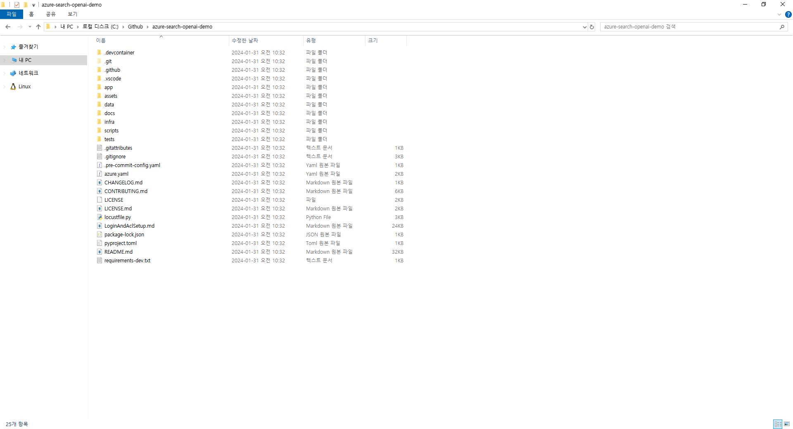
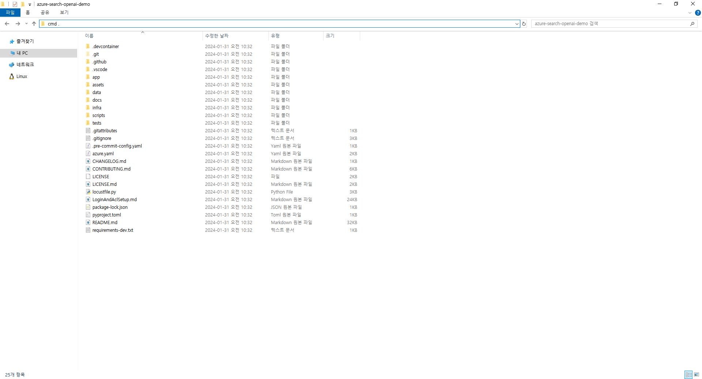
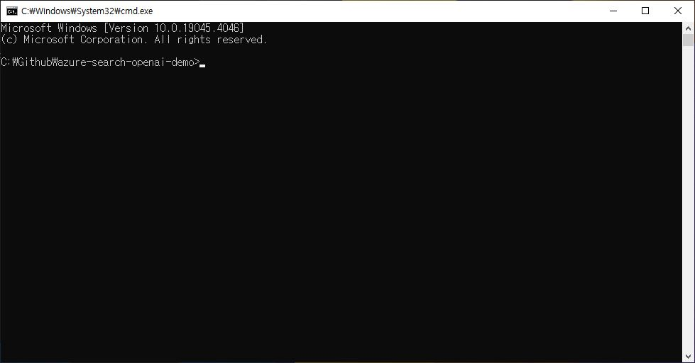

# Window 파일탐색기에서 터미널 바로 실행하기

개발하다보면 가끔 터미널에서 직접 디렉토리 작업 해야할 일이 종종 있습니다.
그럴 때 터미널에서 cd 입력하면서 디렉토리에 접근할 수 있지만 윈도우탐색기에서 직접 디렉토리를 여는 방법에 대해 소개해드리겠습니다.

윈도우 탐색기 단축키 : `Window + E`

윈도우 탐색기 기본 화면

위와 같이 열렸으면 웹 브라우저에서 주소창에 입력하듯이, 윈도우탐색기를 클릭하여 cmd .을 입력합니다.

윈도우 탐색기 URL에서 `cmd .` 입력

잠시 후 cmd창이 실행되는 것을 확인할 수 있습니다.

개인적으로는 요즘 WSL (Linux용 Windows 하위 시스템)에서 작업하는 것도 좋아하는데 다음에 소개해드리겠습니다.
