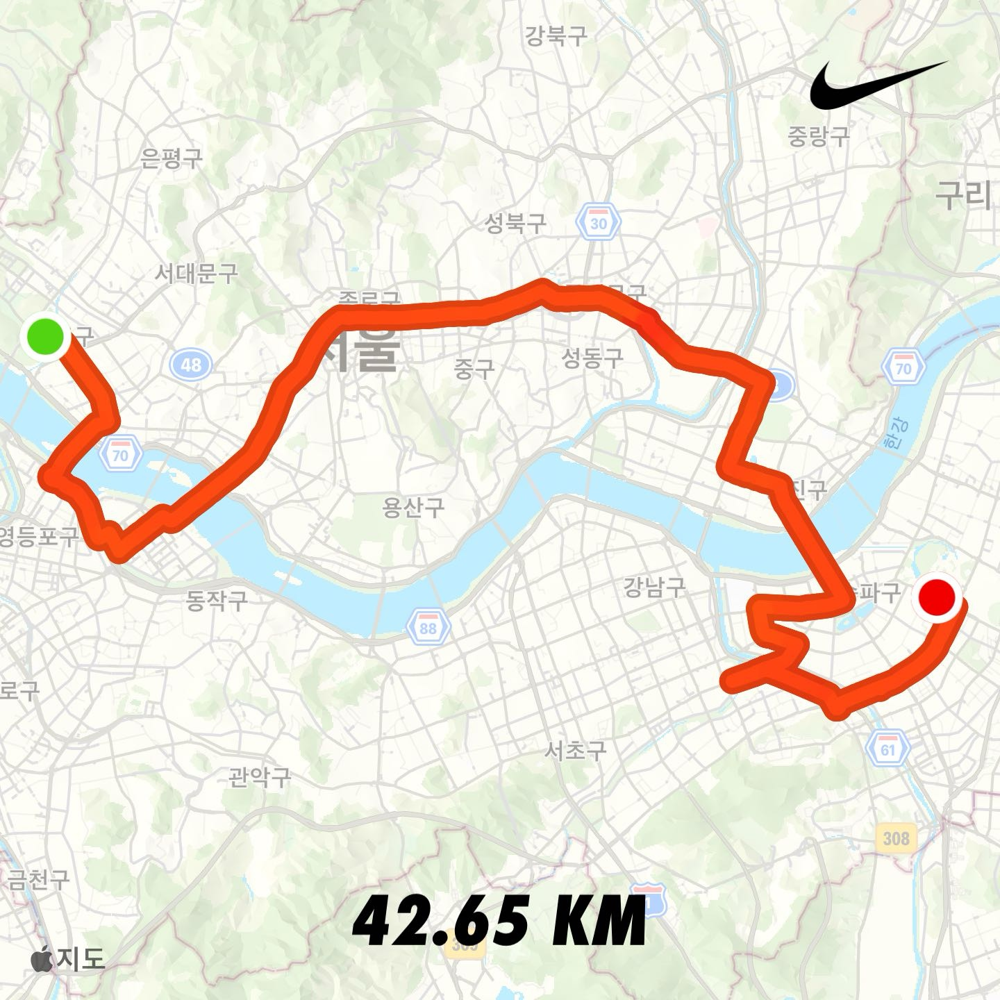

# 2025년 회고

어느 덧 2025년 어느덧 마지막이 되었습니다.

연말이 되면 한 해의 잘한 것들도 되돌아보게 되고, 아쉬움이 남는 것도 곰곰히 생각하게 됩니다.

올해의 키워드를 정리해보고자 합니다.

어떻게 되돌아볼까 고민했는데 인프런의 `2025-growth-report`와 개인적인 것들로 정리해보려고 합니다.

## 월간 러닝

취업준비하기 전에는 정말 많이 뛰었는데 어느 순간 회사를 다니며 러닝하는 게 숙제처럼 느껴지는 순간이 많았습니다.

그래서 어떻게 하면 다시 러닝을 할 수 있을까 고민했는데, 재즈의 계절 및 재즈가 너에게의 저자인 김민주 저자님의 책 구성처럼

월에 해당하는 숫자만큼 러닝을 했습니다.

1월은 1km, 2월은 2km로 시작해 12월은 12km로 마무리하는 흐름이었습니다.

아쉽게 9월의 경우 바쁘고 정신이 없다보니 놓치긴 했지만 9월을 제외한 나머지 모두는 월간 러닝을 완성했습니다.

완성하고나니 페이스나 기록에 상관없이 그저 뿌듯하고 감사합니다.

무엇보다도 11월 2일 JTBC 풀코스 마라톤을 완주할 수 있다는 사실이 정말 감사했습니다.

풀코스 마라톤을 너무 준비없이 나가 정말 고생했지만, 그래도 완주를 하는 것에 큰 의미가 있어 개인적으로는 정말 만족스러운 2025년이었습니다.

처음 10km 마라톤도 2018년 11월 4일에 JTBC를 통해 달렸었는데 7년 후에 JTBC를 통해 풀코스를 완주하니 그 동안 성장한 나 자신이 대견했습니다.

풀코스를 너무 겁먹어서 늦게 도전해서 아쉬운 감이 있지만 그래도 감사합니다.

기회가 된다면 매년 풀코스 마라톤을 도전해보고 싶네요.

## 인프런 학습

생성형 AI가 등장하면서 오히려 기본기에 충실하자고 다짐했습니다.

아무래도 ChatGPT 뿐만 아니라 Gemini, Perplexity등 수많은 생성형 AI가 등장하게 되면서 점점 더 생각하지 않고 AI에 의존하려는

제 자신의 모습을 되돌아볼 수 있었습니다.

인프런에서 좀 도움이 많이 되었던 건 배운 내용을 AI 퀴즈로 복습할 수 있도록 구성하고 계속해서 좋은 강의를 공개하는 것이 저에게는 큰 도전이자

배움의 끈을 놓지 않게 만들어 주었습니다.

때로는 강의를 구매하기만 하고 다 듣지 못해 자신 스스로가 게으르게 느껴질 때도 있었지만 `완벽주의`보다는 `완주`에 집중하려고 노력했습니다.

따라가는 로드맵을 `목적지`가 아닌 `지도`로 이용하려고 애를 썼습니다.

그렇게 해서 **16개**의 강의 수강, **6개**의 강의 완강, 인프런 학습 상위 **10%**를 달성할 수 있었습니다.

한 때는 로드맵을 달성하지 못해 죄책감이 컸는데, Gemini가 말해준 것처럼 **완벽주의** 보다는 **완주**에 의미를 두고

배운 개념을 내 말로 설명할 수 있을때까지 노력했습니다.

## ⭐️ Star

요즘 흑백요리사 시즌2를 정말 재미있게 보고 있습니다.

그 중 손종원 쉐프님이 하신 말이 머릿속에서 떠나가지 않습니다.

> "저도 3스타 레스토랑에서 세 군데에서 일을 했어요, 사실
> 제가 일했던 3스타가 저를 3스타로 만들진 않더라고요
> 그, 저의 스타는 제가 만들어 가야 되는 거거든요
> 저 막으실 수 있으시겠어요?" [흑백요리사: 요리 계급 전쟁 3화]

흑백요리사는 요리사 분들의 경쟁이지만, 개발자로써 임해야하는 태도에 대해 되돌아보고 반성하게 되었습니다.

내가 처한 소속이나 환경이 나를 만들어주는 게 아닌 내가 직접 만들어가야하는 것임을 기억하며 2025년을 마무리하고

2026년 한 걸음 내딛겠습니다.
