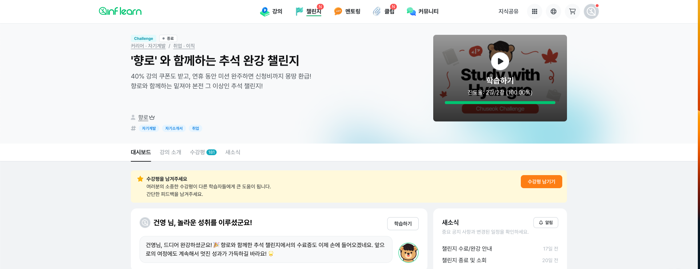
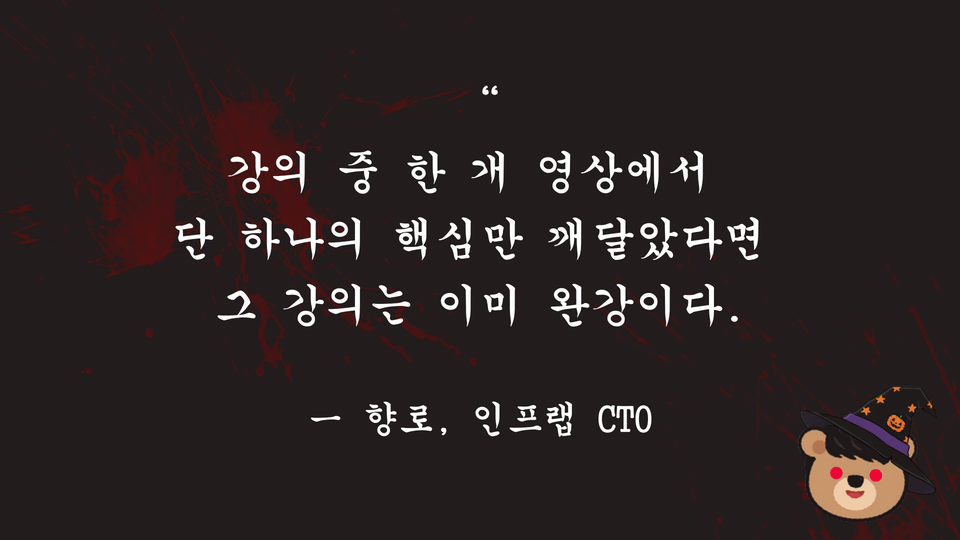

# 인프런(Inflearn) 챌린지 회고

## 반복되는 삶

"빨리 가려면 혼자 가고, 멀리 가려면 함께 가라" 라는 말이 있습니다.

삼성 청년 SW 아카데미 1학기 수료한 이후 취업하고 일을 하다보니 삶을 되돌아보고 공부할 시간이 마땅치 않았습니다.

회사 일을 하고 집에 돌아와서 저녁 먹고 하루를 보내다 보면 어느덧 하루가 지나가있었습니다.

회사 1-2년차에는 강의를 듣고 소화하는 것 자체가 어려웠는데 이제는 조금씩 강의를 듣고 소화할 수 있는 힘이 생길 수 있었습니다.

오랫동안 러닝을 하면서 체력을 기를 수 있어 가능했던 것 같습니다.

그래도 혼자 강의 듣는 것에 한계를 느끼던 중 자극이 되고 개인적으로 재미있었던 시간 중 하나가 바로 인프런 챌린지였습니다.

## 도전, Challenge

올해 추석 연휴가 정말 길었던 터라 시간을 혼자 보내면 그냥 하염없이 흘러갔을 것 같은데 향로님과 함께 또 인프런 수강생 분들과 함께

각자가 정한 강의를 듣는 챌린지가 도움이 많이 됐습니다. 또, 중간중간 있는 향로님의 라이브와 이번 챌린지의 내용도 복기를 해주셔서

더더욱 소중하고 알찬 시간이었습니다. 이 기간때 다 들을 수 있을 것 같은 분량의 강의를 완강했는데 스스로 자기효능감을 느낄 수 있었습니다.

그리고 좋았던 점은 이번 챌린지를 통해서 40% 강의 할인 쿠폰이 발급되서 제가 그 동안 구매하기 망설였던 강의들을 수집할 수 있었습니다.

사실, 사놓고도 다 완강하지 못한 강의가 제 인프런 계정에 아직 좀 있는데도 책을 구매하는 것처럼 계속 구매하게 되는 마법이 있습니다..

그래도 책이 소장의 가치(?)가 있는 만큼 강의도 소장하고 수집하는 재미가 있는 것 같습니다.

## 향로윈에도 계속되는 챌린지

위 챌린지를 완강하고 주어진 40% 강의할인 쿠폰을 통해 또 제가 구매하고 싶었던 분들의 강의를 구매할 수 있었습니다.

그리고 나서 또 챌린지가 등장했으니 바로 할로윈이 아닌 향로윈이었습니다. 🎃 개발바닥을 통해 좋은 영향력을 제공해주시는 향로님께서

또 챌린지를 열어주셔서 즐거운 마음으로 참여할 수 있었습니다. 운이 좋았던 게 지난번 받은 40% 할인 쿠폰으로 챌린지도 40% 할인 받아 참여할 수 있어서

더더욱 동기부여가 됐던 것 같습니다. 이번 챌린지에서 가장 와 닿았던 멘트는

> 다만, 학습 따른 결과는 본인의 몫임을 미리 알려드립니다. 👻

우리가 흔히 단 한 문장으로 요약할 수 있다면이라는 질문을 종종 받는데 이번 챌린지는 그 핵심을 전달해주는 챌린지였습니다.

2025년도도 벌써 60일 정도밖에 남지 않았습니다. 모든 시간을 생산적으로, 효율적으로 보낼 수는 없겠지만 주어진 시간을 앞으로도 알차게 보내야 겠다라는

마음 가짐의 변화를 가져다 준 챌린지였는데 다음에도 계속 열린다고 하니 참여를 추천합니다!
