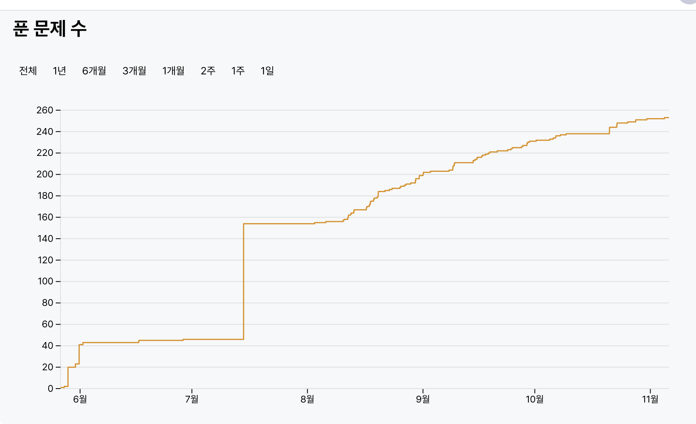
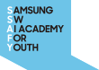

# 삼성 청년 SW 아카데미 (SSAFY) 회고

2021년 7월에 SSAFY를 시작했던 게 엊그제 같은데 벌써 시간이 4년이나 지났습니다. SSAFY하면서 좋았던 점을 이곳에 정리해봅니다.
제 1학기 과정을 되돌아보며 삼성 청년 SW 아카데미 (SSAFY)를 추천해드리고자 합니다. 제가 SSAFY를 추천해드리는 이유는 아래와 같습니다.

## 알고리즘 학습 및 코딩테스트 준비

**첫째, 1학기 과정을 통해 알고리즘 문제를 이해하고, 설계하고, 해결하는 방법을 배울 수 있었습니다.**

SSAFY는 반별 트랙마다 교육 내용이 다르지만, 문제 해결 능력을 기르기 위한 알고리즘 문제 풀이는 모두 동일하게 배워나갑니다.
1학기 대부분의 시간을 알고리즘 문제 해결 방법을 공부합니다. 이 과정을 통해 우리 일상 속의 문제도 이해하고, 알고리즘 문제도 배울 수 있었습니다.
알고리즘과 친숙하지 않던 제가 공부할 수 있게끔 만들어 주었습니다. 7월에 입과하고 나서 https://boj.kr/ 의 쉬운문제부터 조금씩 난이도 높은 문제까지 도전할 수 있었습니다.
아직 개인적으로 연습이 많이 필요하지만 그래도 조금씩 성장해나가는 자신을 발견할 수 있었습니다.📁

## 공부, 취업에 집중할 수 있도록 도움

**둘째, 공부와 취업 준비를 금전적으로 구애받지 않고 원활하게 준비할 수 있었습니다.**

아무래도 취업준비를 하다 보면 생활비, 교재비, 자격증 시험비 등 돈을 지출할 곳이 많습니다.
하지만, **SSAFY에서는 모든 교육생들에게 교육지원금으로 월 100만원씩 제공하기 때문에 공부와 취업준비에 좀 더 집중할 수 있습니다.**
무엇보다도 교육지원금을 받으면서 해보고 싶었던 Algorithm 공부에 온전히 집중할 수 있다는 것에 정말 감사함을 느꼈습니다.
또, 학기가 시작하게되면 다양한 이벤트, 기프티콘이 있어 입이 심심치 않게(?) 공부할 수 있습니다. **제가 받았던 기프티콘 내역을 확인해봤는데 약 20만원에 가까운 기프티콘을 수령했습니다.**
참여도에 따라 더 많이 받을 수도 있을 것 같다고 생각했습니다.

## 함께 취업준비 및 진로를 고민할 수 있는 동료, 교수님들

**마지막으로 취업 준비를 함께할 수 있는 동료와 모든 교육생들을 적극적으로 응원해주시는 프로님들, 교수님들을 만날 수 있습니다.**
SSAFY 과정은 각 트랙별로, 반별로 나눠져서 공부하게 되어 같은 반 안에서 스터디원들과 함께 취업준비를 할 수 있습니다.
그리고 각 반별마다 담당 교수님들, 담당 프로님들이 계시고 교수님, 프로님들께서 학생 한 명 한 명 진심으로 대해주시고 챙겨주셔서 좀 더 공부에 집중할 수 있고, 취업준비를 할 수 있습니다.
또, SSAFY 교육생만이 이용할 수 있는 여러 가지 취업 준비 tool이 정말 많습니다.

  
저에게 SSAFY는 '기본기'를 준비하는 시간이었습니다. 제가 경험했던 시간을 [SSAFY](https://www.ssafy.com/)에 관심있는 분들께 꼭 추천드립니다.
